# Mobile Counter Application - Technical Documentation

## Table of Contents

1. [Project Overview](#project-overview)
2. [Architecture Overview](#architecture-overview)
3. [Technology Stack](#technology-stack)
4. [Project Structure](#project-structure)
5. [Feature Architecture](#feature-architecture)
6. [Data Flow](#data-flow)
7. [State Management](#state-management)
8. [Navigation Flow](#navigation-flow)
9. [Development Workflow](#development-workflow)
10. [Deployment](#deployment)

## Project Overview

The Mobile Counter Application is a React Native/Expo-based mobile application designed for managing customer service counters and ticket systems. The application provides a modern, cross-platform solution for counter management with features including authentication, ticket management, settings, and developer tools.

### Key Features

- **Counter Management**: Real-time ticket processing and customer service management
- **Authentication System**: Secure user authentication and authorization
- **Settings Management**: User preferences and application configuration
- **Developer Tools**: Debugging and development utilities
- **Cross-Platform**: iOS, Android, and Web support via Expo

## Architecture Overview

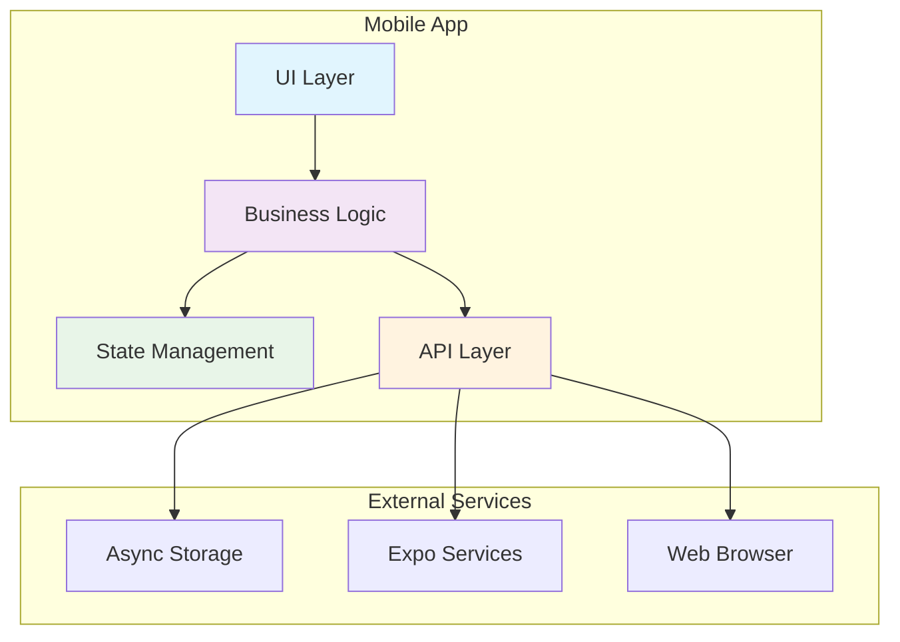

## Technology Stack

### Core Technologies

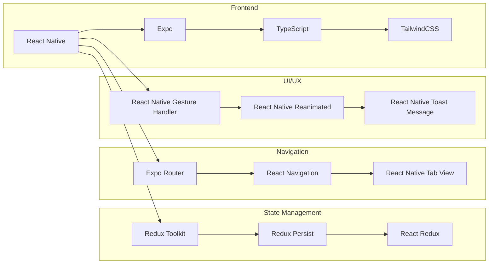

### Development Tools

- **ESLint**: Code linting and quality assurance
- **Prettier**: Code formatting
- **TypeScript**: Type safety and development experience
- **Metro**: React Native bundler
- **Babel**: JavaScript compiler

## Project Structure

```mermaid
graph TD
    A[mobile-counter] --> B[app/]
    A --> C[features/]
    A --> D[assets/]
    A --> E[libs/]
    A --> F[android/]
    A --> G[Configuration Files]
    
    B --> B1[_layout.tsx]
    B --> B2[auth/]
    B --> B3[(tabs)/]
    B --> B4[(developer)/]
    
    C --> C1[auth/]
    C --> C2[counter/]
    C --> C3[customer/]
    C --> C4[developer/]
    C --> C5[error/]
    C --> C6[navigation/]
    C --> C7[queue/]
    C --> C8[settings/]
    C --> C9[config/]
    
    G --> G1[package.json]
    G --> G2[app.config.ts]
    G --> G3[tsconfig.json]
    G --> G4[tailwind.config.js]
    G --> G5[metro.config.js]
    G --> G6[babel.config.js]
    G --> G7[eslint.config.js]
    G --> G8[.prettierrc]
```

## Feature Architecture

### Feature-Based Organization

Each feature follows a consistent structure for maintainability and scalability:

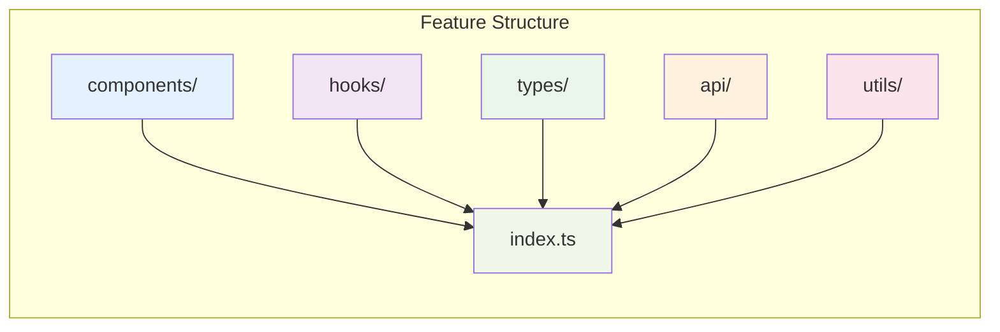

### Feature Dependencies

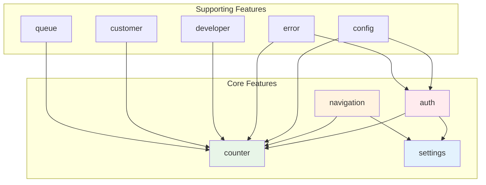

## Data Flow

### Application State Flow

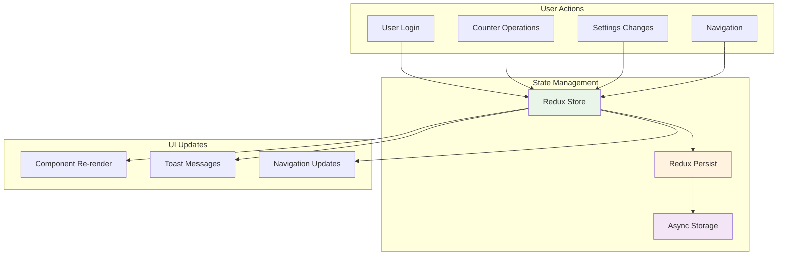

### API Data Flow

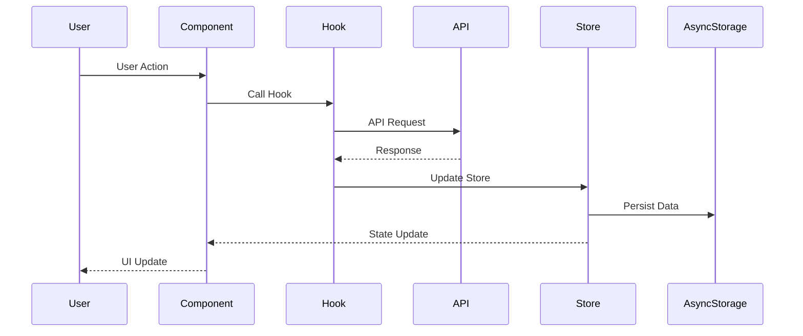

## State Management

### Redux Store Structure

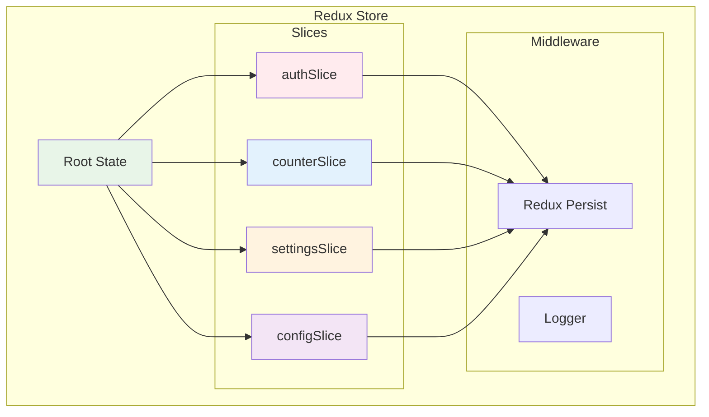

### State Persistence Flow

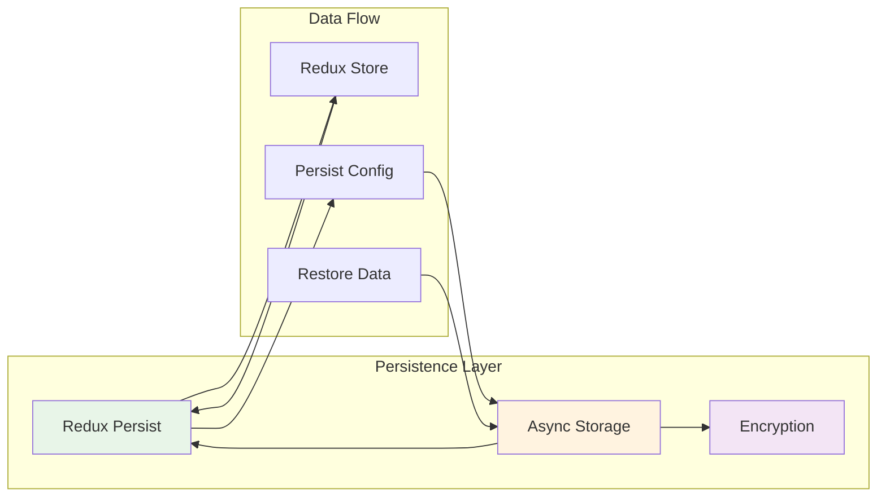

## Navigation Flow

### App Navigation Structure

```mermaid
graph TD
    subgraph "App Router"
        ROOT[_layout.tsx]
        
        subgraph "Main Routes"
            AUTH[auth/]
            TABS[(tabs)/]
            DEV[(developer)/]
        end
        
        subgraph "Tab Routes"
            HOME[index.tsx]
            SETTINGS[setting.tsx]
        end
        
        subgraph "Auth Routes"
            LOGIN[login.tsx]
            REGISTER[register.tsx]
        end
        
        subgraph "Developer Routes"
            DEV_TOOLS[dev-tools.tsx]
            DEBUG[debug.tsx]
        end
    end
    
    ROOT --> AUTH
    ROOT --> TABS
    ROOT --> DEV
    
    TABS --> HOME
    TABS --> SETTINGS
    
    AUTH --> LOGIN
    AUTH --> REGISTER
    
    DEV --> DEV_TOOLS
    DEV --> DEBUG
    
    style ROOT fill:#e8f5e8
    style AUTH fill:#ffebee
    style TABS fill:#e3f2fd
    style DEV fill:#fff3e0
```

### Navigation State Management

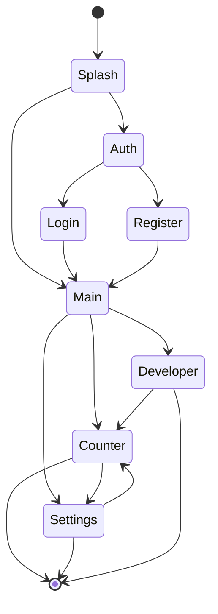

## Development Workflow

### Development Environment Setup

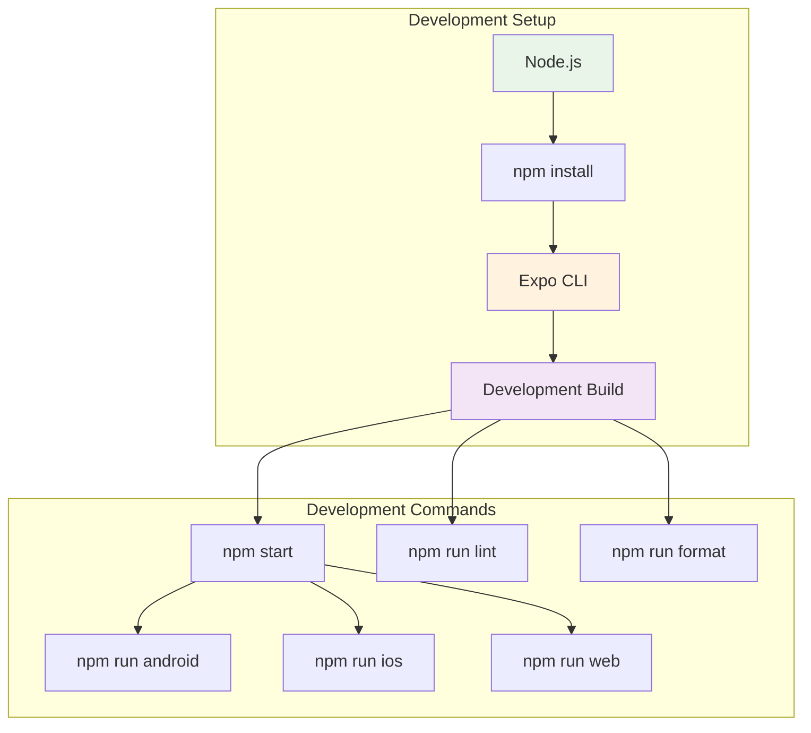

### Code Quality Pipeline

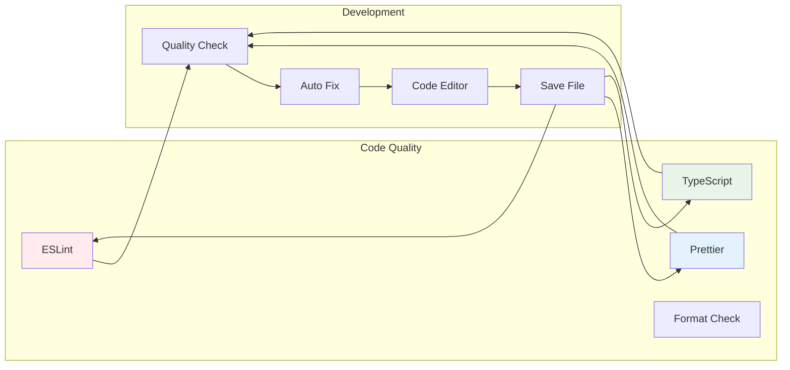

## Deployment

### Build and Deployment Process

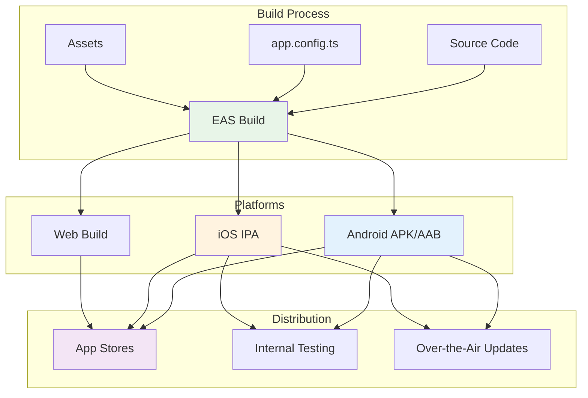

### Configuration Management

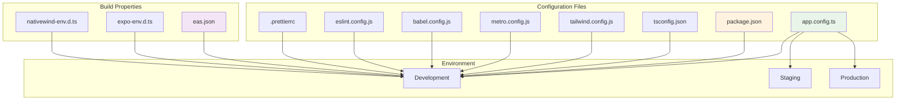

## Key Features Documentation

### Counter Feature

The counter feature is the core functionality of the application, providing ticket management and customer service operations.

**Components:**
- `CounterScreen`: Main counter interface
- `TicketDisplay`: Ticket information display
- `CounterControls`: Counter operation controls

**Hooks:**
- `useCounter`: Counter state management
- `useTicket`: Ticket operations

**Types:**
- `Ticket`: Ticket data structure
- `CounterState`: Counter application state

### Authentication Feature

Handles user authentication, authorization, and session management.

**Components:**
- `LoginScreen`: User login interface
- `RegisterScreen`: User registration interface
- `AuthProvider`: Authentication context provider

**API:**
- `authApi`: Authentication API calls
- `employeeApi`: Employee management

**Types:**
- `User`: User data structure
- `AuthState`: Authentication state

### Settings Feature

Manages user preferences and application configuration.

**Components:**
- `SettingsScreen`: Settings interface
- `SettingRow`: Individual setting row
- `InfoRow`: Information display row

**Hooks:**
- `useSettings`: Settings state management

**Types:**
- `SettingsState`: Settings application state
- `SettingRowProps`: Setting row properties

## Best Practices

### Code Organization

1. **Feature-Based Architecture**: Organize code by features rather than technical concerns
2. **TypeScript First**: Use TypeScript for all new code
3. **Custom Hooks**: Extract business logic into custom hooks
4. **Component Composition**: Use composition over inheritance
5. **Consistent Naming**: Follow consistent naming conventions

### Performance Optimization

1. **Memoization**: Use React.memo for expensive components
2. **Lazy Loading**: Implement lazy loading for routes
3. **Image Optimization**: Use Expo Image for optimized image loading
4. **Bundle Optimization**: Minimize bundle size with tree shaking

### Security Considerations

1. **Secure Storage**: Use AsyncStorage for sensitive data
2. **Input Validation**: Validate all user inputs
3. **API Security**: Implement proper API authentication
4. **Code Obfuscation**: Protect sensitive code in production

## Troubleshooting

### Common Issues

1. **Metro Bundler Issues**: Clear cache with `npx expo start -c`
2. **TypeScript Errors**: Run `npx tsc --noEmit` to check types
3. **Linting Issues**: Run `npm run lint` to identify issues
4. **Formatting Issues**: Run `npm run format` to fix formatting

### Debug Tools

1. **React Native Debugger**: For debugging React Native applications
2. **Flipper**: For debugging and inspecting app state
3. **Expo DevTools**: For Expo-specific debugging
4. **Redux DevTools**: For Redux state inspection

## References

- [Expo Documentation](https://docs.expo.dev/)
- [React Native Documentation](https://reactnative.dev/)
- [Redux Toolkit Documentation](https://redux-toolkit.js.org/)
- [TypeScript Documentation](https://www.typescriptlang.org/)
- [TailwindCSS Documentation](https://tailwindcss.com/)

---

*This documentation is maintained as part of the Mobile Counter Application project. For updates and contributions, please refer to the project repository.* 