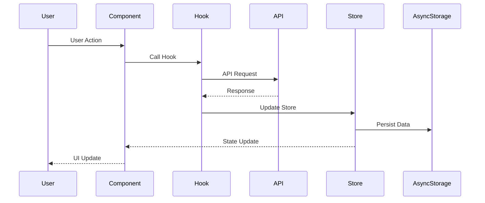
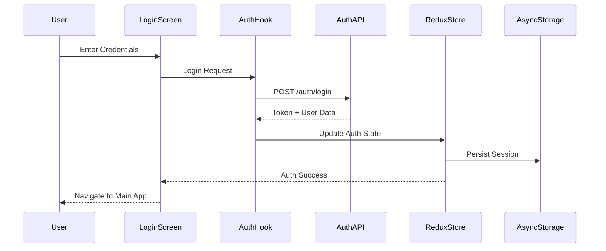
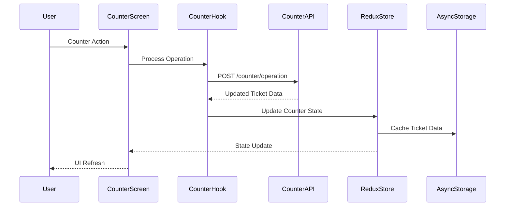
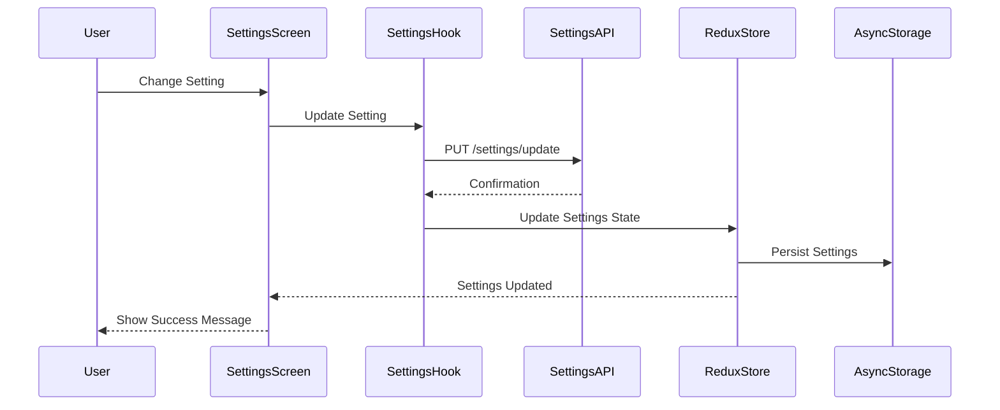
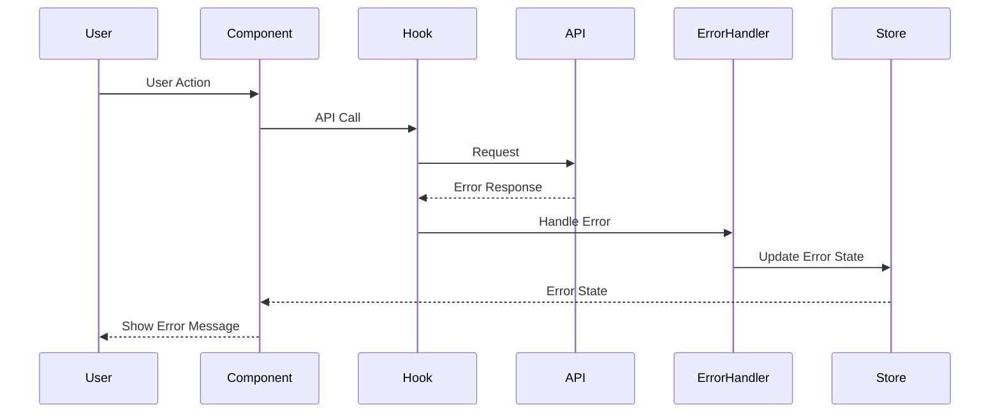
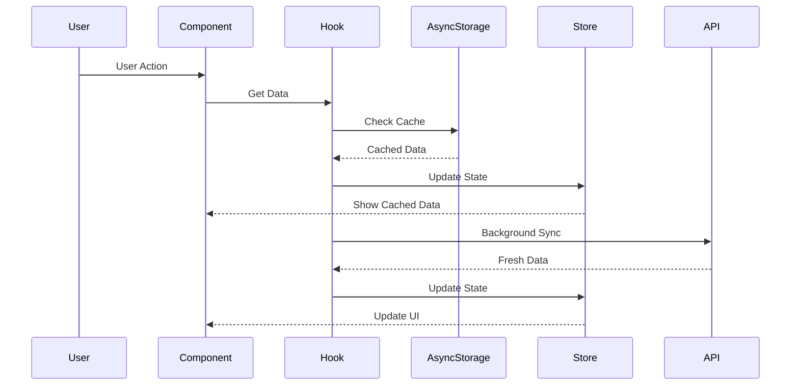

# Mobile Counter Application - Technical Documentation

## Table of Contents

1. [Project Overview](#project-overview)
2. [Architecture Overview](#architecture-overview)
3. [Technology Stack](#technology-stack)
4. [Project Structure](#project-structure)
5. [Feature Architecture](#feature-architecture)
6. [Data Flow](#data-flow)
7. [State Management](#state-management)
8. [Navigation Flow](#navigation-flow)
9. [Development Workflow](#development-workflow)
10. [Deployment](#deployment)

## Project Overview

The Mobile Counter Application is a React Native/Expo-based mobile application designed for managing customer service counters and ticket systems. The application provides a modern, cross-platform solution for counter management with features including authentication, ticket management, settings, and developer tools.

### Key Features

- **Counter Management**: Real-time ticket processing and customer service management
- **Authentication System**: Secure user authentication and authorization
- **Settings Management**: User preferences and application configuration
- **Developer Tools**: Debugging and development utilities
- **Cross-Platform**: iOS, Android, and Web support via Expo

## Architecture Overview

The Mobile Counter Application follows a layered architecture pattern with clear separation of concerns:

### Application Layers

**UI Layer**: React Native components and screens that handle user interactions and display
**Business Logic Layer**: Custom hooks and utility functions that contain application logic
**State Management Layer**: Redux store and slices that manage application state
**API Layer**: Network requests and external service integrations

### External Services

**Async Storage**: Local data persistence for user preferences and cached data
**Expo Services**: Platform-specific services like notifications, device info, and updates
**Web Browser**: External web content and authentication flows

### Data Flow

User interactions flow from the UI Layer through Business Logic to State Management, with the API Layer handling external communications. State changes flow back up through the layers to update the UI.

## Technology Stack

### Core Technologies

The application is built using a modern React Native stack with the following key technologies:

**Frontend Framework**
- **React Native**: Cross-platform mobile development framework
- **Expo**: Development platform and toolchain
- **TypeScript**: Type-safe JavaScript development
- **TailwindCSS**: Utility-first CSS framework via NativeWind

**State Management**
- **Redux Toolkit**: Modern Redux with simplified boilerplate
- **Redux Persist**: State persistence across app sessions
- **React Redux**: React bindings for Redux

**Navigation**
- **Expo Router**: File-based routing system
- **React Navigation**: Navigation library for React Native
- **React Native Tab View**: Tab navigation components

**UI/UX Libraries**
- **React Native Gesture Handler**: Touch and gesture handling
- **React Native Reanimated**: Smooth animations and interactions
- **React Native Toast Message**: User notification system

### Development Tools

- **ESLint**: Code linting and quality assurance
- **Prettier**: Code formatting
- **TypeScript**: Type safety and development experience
- **Metro**: React Native bundler
- **Babel**: JavaScript compiler

## Project Structure

The project follows a feature-based architecture with clear separation of concerns:

### Root Directory Structure

```
mobile-counter/
├── app/                    # Expo Router app directory
├── features/              # Feature-based modules
├── assets/                # Static assets (images, fonts)
├── libs/                  # Shared libraries and utilities
├── android/               # Android-specific configurations
└── Configuration Files    # Build and development configs
```

### App Directory (`app/`)

- **_layout.tsx**: Root layout component
- **auth/**: Authentication routes and screens
- **(tabs)/**: Tab-based navigation screens
- **(developer)/**: Developer tools and debugging screens

### Features Directory (`features/`)

- **auth/**: Authentication logic and components
- **counter/**: Core counter functionality
- **customer/**: Customer management features
- **developer/**: Developer tools and utilities
- **error/**: Error handling and error boundaries
- **navigation/**: Navigation components and logic
- **queue/**: Queue management functionality
- **settings/**: User settings and preferences
- **config/**: Application configuration

### Configuration Files

- **package.json**: Dependencies and scripts
- **app.config.ts**: Expo application configuration
- **tsconfig.json**: TypeScript configuration
- **tailwind.config.js**: TailwindCSS configuration
- **metro.config.js**: Metro bundler configuration
- **babel.config.js**: Babel transpiler configuration
- **eslint.config.js**: ESLint linting rules
- **.prettierrc**: Prettier formatting configuration

## Feature Architecture

### Feature-Based Organization

Each feature follows a consistent structure for maintainability and scalability:

**Standard Feature Structure**
```
feature-name/
├── components/     # React components
├── hooks/          # Custom hooks
├── types/          # TypeScript interfaces/types
├── api/            # API calls (if applicable)
├── utils/          # Utility functions (if applicable)
└── index.ts        # Main exports
```

**Component Organization**
- **components/**: Reusable UI components specific to the feature
- **hooks/**: Custom React hooks for business logic
- **types/**: TypeScript type definitions and interfaces
- **api/**: API integration and data fetching logic
- **utils/**: Helper functions and utilities
- **index.ts**: Central export point for the feature

### Feature Dependencies

The application features are organized with clear dependencies and relationships:

**Core Features**
- **auth**: Authentication and user management (required by counter and settings)
- **counter**: Main counter functionality (depends on auth and config)
- **settings**: User preferences and configuration (depends on auth)
- **navigation**: Tab navigation and routing (used by counter and settings)

**Supporting Features**
- **config**: Application configuration (used by auth and counter)
- **error**: Error handling and boundaries (used by auth and counter)
- **developer**: Developer tools and debugging (used by counter)
- **customer**: Customer management (used by counter)
- **queue**: Queue management (used by counter)

**Dependency Flow**
- Authentication is required before accessing counter and settings
- Navigation provides the tab structure for main features
- Configuration and error handling support core features
- Developer tools enhance counter functionality
- Customer and queue management extend counter capabilities

## Data Flow

### Application State Flow

The application follows a unidirectional data flow pattern with Redux as the central state management solution:

**User Actions**
- **User Login**: Authentication state changes trigger UI updates
- **Counter Operations**: Ticket processing and counter state management
- **Settings Changes**: User preference updates and configuration changes
- **Navigation**: Route changes and tab switching

**State Management**
- **Redux Store**: Centralized state container with multiple slices
- **Redux Persist**: State persistence across app sessions
- **Async Storage**: Local data storage for offline functionality

**UI Updates**
- **Component Re-render**: React components update based on state changes
- **Toast Messages**: User notifications for actions and errors
- **Navigation Updates**: Route changes and tab state updates

**Data Flow Pattern**
1. User performs an action (login, counter operation, etc.)
2. Action is dispatched to Redux store
3. Reducer updates the state
4. State changes trigger component re-renders
5. UI updates reflect the new state
6. State is persisted to Async Storage for offline access

### API Data Flow

The application uses a structured approach for API interactions and data management:

#### General API Interaction Flow



#### Authentication API Flow



#### Counter Operations API Flow



#### Settings API Flow



#### Error Handling Flow



#### Offline Data Flow



**API Interaction Pattern**
1. **User Action**: User interacts with a component (login, counter operation, etc.)
2. **Component Handler**: Component calls a custom hook to handle the action
3. **Hook Processing**: Custom hook makes API request and manages loading states
4. **API Request**: Network request is made to backend services
5. **Response Handling**: API response is processed and validated
6. **Store Update**: Redux store is updated with new data
7. **Data Persistence**: Important data is saved to Async Storage
8. **UI Update**: Components re-render with updated state
9. **User Feedback**: User sees updated interface and any notifications

**Error Handling**
- Network errors are caught and displayed to users
- Loading states are managed during API calls
- Offline functionality is supported through cached data
- Retry mechanisms are implemented for failed requests

## State Management

### Redux Store Structure

The application uses Redux Toolkit for centralized state management with a modular slice-based architecture:

**Root State Structure**
```
Root State
├── authSlice          # Authentication and user state
├── counterSlice       # Counter operations and ticket state
├── settingsSlice      # User preferences and app settings
└── configSlice        # Application configuration
```

**State Slices**

**authSlice**
- User authentication status
- User profile information
- Login/logout state
- Session management

**counterSlice**
- Current ticket information
- Counter status and operations
- Queue management state
- Ticket history

**settingsSlice**
- User preferences
- App configuration
- Theme and display settings
- Notification preferences

**configSlice**
- Application configuration
- Feature flags
- Environment settings
- API endpoints

**Middleware**
- **Redux Persist**: Automatically saves and restores state
- **Logger**: Development logging for debugging

### State Persistence Flow

The application implements robust state persistence to maintain user data across sessions:

**Persistence Architecture**

**Redux Persist**
- Automatically saves Redux state to Async Storage
- Handles state serialization and deserialization
- Manages state restoration on app startup
- Configurable persistence strategies

**Async Storage**
- Local storage for sensitive user data
- Offline data caching
- User preferences and settings
- Session information

**Data Flow Process**
1. **State Changes**: Redux store updates trigger persistence
2. **Serialization**: State is serialized to JSON format
3. **Storage**: Data is saved to Async Storage
4. **Encryption**: Sensitive data is encrypted before storage
5. **Restoration**: On app startup, data is restored from storage
6. **State Update**: Restored data populates Redux store

**Persistence Configuration**
- Selective state persistence (not all state is persisted)
- Encryption for sensitive data
- Automatic cleanup of old data
- Error handling for storage failures

## Navigation Flow

### App Navigation Structure

The application uses Expo Router for file-based navigation with a hierarchical structure:

**Root Layout (`_layout.tsx`)**
- Main app container and navigation provider
- Handles authentication state and routing logic
- Manages global app state and providers

**Main Route Groups**

**Authentication Routes (`auth/`)**
- `login.tsx`: User login screen
- `register.tsx`: User registration screen
- Handles authentication flow and user onboarding

**Tab Navigation (`(tabs)/`)**
- `index.tsx`: Main counter/home screen
- `setting.tsx`: User settings and preferences
- Provides tab-based navigation for core features

**Developer Routes (`(developer)/`)**
- `dev-tools.tsx`: Developer utilities and debugging tools
- `debug.tsx`: Debug information and logs
- Available only in development builds

**Navigation Flow**
- App starts with root layout
- Authentication state determines initial route
- Authenticated users see tab navigation
- Developer routes are conditionally available

### Navigation State Management

The application implements a state-driven navigation system with clear user flow:

**Application States**

**Initial State**
- **Splash Screen**: App startup and initialization
- **Authentication Check**: Determines if user is logged in
- **Route Decision**: Directs to auth or main app

**Authentication Flow**
- **Login Screen**: User authentication interface
- **Register Screen**: New user registration
- **Authentication Success**: Redirects to main application

**Main Application States**
- **Counter Screen**: Primary counter functionality
- **Settings Screen**: User preferences and configuration
- **Developer Tools**: Debug and development utilities

**Navigation Patterns**
- **Tab Navigation**: Seamless switching between counter and settings
- **Modal Navigation**: Overlay screens for detailed views
- **Stack Navigation**: Hierarchical navigation within features
- **Conditional Navigation**: Developer routes only in development

**State Transitions**
- Authentication state changes trigger navigation updates
- Tab switching maintains state across screens
- Deep linking supports direct navigation to specific screens
- Back navigation preserves user context

## Development Workflow

### Development Environment Setup

The development workflow is streamlined with modern tools and automation:

**Development Prerequisites**
- **Node.js**: JavaScript runtime environment
- **npm**: Package manager for dependencies
- **Expo CLI**: Development tools and build system
- **Development Build**: Custom build for native features

**Development Commands**

**Core Development**
- `npm start`: Starts Expo development server
- `npm run android`: Runs app on Android emulator/device
- `npm run ios`: Runs app on iOS simulator/device
- `npm run web`: Runs app in web browser

**Code Quality**
- `npm run lint`: Runs ESLint for code quality checks
- `npm run format`: Formats code with Prettier
- `npm run format:check`: Checks code formatting without changes

**Build and Deployment**
- `npm run reset-project`: Resets project to clean state
- EAS Build: Cloud-based build system for production builds

**Development Workflow**
1. Install dependencies with `npm install`
2. Start development server with `npm start`
3. Choose target platform (Android/iOS/Web)
4. Make code changes with live reload
5. Run quality checks before committing
6. Build for production when ready

### Code Quality Pipeline

The application implements a comprehensive code quality pipeline to ensure maintainable and consistent code:

**Code Quality Tools**

**ESLint**
- Static code analysis and linting
- Enforces coding standards and best practices
- Catches potential errors and code smells
- Configurable rules for project-specific requirements

**Prettier**
- Automatic code formatting
- Consistent code style across the project
- Integration with ESLint for seamless workflow
- Configurable formatting rules

**TypeScript**
- Static type checking
- Enhanced IDE support and IntelliSense
- Catches type-related errors at compile time
- Improves code maintainability and documentation

**Quality Assurance Process**
1. **Code Editor**: Developer writes code in IDE
2. **Save Trigger**: File save triggers quality checks
3. **Linting**: ESLint analyzes code for issues
4. **Formatting**: Prettier ensures consistent formatting
5. **Type Checking**: TypeScript validates types
6. **Quality Check**: All tools report issues
7. **Auto Fix**: Automatic fixes are applied where possible
8. **Manual Review**: Developer addresses remaining issues

**Quality Standards**
- Zero ESLint errors in production code
- Consistent formatting across all files
- TypeScript strict mode compliance
- Regular code reviews and quality checks

## Deployment

### Build and Deployment Process

The application uses EAS (Expo Application Services) for streamlined build and deployment:

**Build Process**

**Source Management**
- **Source Code**: React Native/Expo application code
- **Configuration**: `app.config.ts` defines build settings
- **Assets**: Images, fonts, and static resources
- **Dependencies**: Managed through `package.json`

**EAS Build System**
- **Cloud Builds**: Automated builds in Expo's cloud infrastructure
- **Multi-Platform**: Simultaneous builds for Android, iOS, and Web
- **Environment Management**: Different configurations for dev/staging/prod
- **Build Profiles**: Optimized settings for each platform

**Platform Outputs**

**Android**
- **APK**: Direct installation package for testing
- **AAB**: App Bundle for Google Play Store distribution
- **Optimized**: Size-optimized builds with code splitting

**iOS**
- **IPA**: iOS application package
- **App Store**: Optimized for App Store distribution
- **Enterprise**: Internal distribution builds

**Web**
- **Static Build**: Optimized web application
- **PWA Support**: Progressive Web App capabilities
- **CDN Ready**: Optimized for content delivery networks

**Distribution Channels**

**App Stores**
- **Google Play Store**: Android app distribution
- **Apple App Store**: iOS app distribution
- **Web Deployment**: Hosted web application

**Internal Distribution**
- **TestFlight**: iOS beta testing platform
- **Internal Testing**: Direct APK distribution
- **Enterprise Distribution**: Internal company distribution

**Over-the-Air Updates**
- **Expo Updates**: Instant updates without app store approval
- **Code Push**: JavaScript bundle updates
- **Configuration Updates**: Remote configuration changes

### Configuration Management

The application uses a comprehensive configuration management system to handle different environments and build requirements:

**Configuration Files**

**Core Configuration**
- **app.config.ts**: Expo application configuration and metadata
- **package.json**: Dependencies, scripts, and project metadata
- **tsconfig.json**: TypeScript compiler configuration
- **tailwind.config.js**: TailwindCSS styling configuration

**Build Configuration**
- **metro.config.js**: Metro bundler configuration
- **babel.config.js**: Babel transpiler settings
- **eslint.config.js**: Code linting rules and standards
- **.prettierrc**: Code formatting configuration

**Environment Management**

**Development Environment**
- Local development with hot reload
- Debug tools and development features
- Detailed error messages and logging
- Development-specific API endpoints

**Staging Environment**
- Pre-production testing environment
- Production-like configuration
- Testing with real data
- Performance monitoring

**Production Environment**
- Optimized builds for app stores
- Minimal logging and debugging
- Production API endpoints
- Performance optimizations

**Build Properties**
- **eas.json**: EAS build configuration and profiles
- **expo-env.d.ts**: Expo environment type definitions
- **nativewind-env.d.ts**: NativeWind environment types

**Configuration Strategy**
- Environment-specific configuration files
- Conditional compilation for different environments
- Secure handling of sensitive configuration
- Automated configuration validation

## Key Features Documentation

### Counter Feature

The counter feature is the core functionality of the application, providing ticket management and customer service operations.

**Components:**
- `CounterScreen`: Main counter interface
- `TicketDisplay`: Ticket information display
- `CounterControls`: Counter operation controls

**Hooks:**
- `useCounter`: Counter state management
- `useTicket`: Ticket operations

**Types:**
- `Ticket`: Ticket data structure
- `CounterState`: Counter application state

### Authentication Feature

Handles user authentication, authorization, and session management.

**Components:**
- `LoginScreen`: User login interface
- `RegisterScreen`: User registration interface
- `AuthProvider`: Authentication context provider

**API:**
- `authApi`: Authentication API calls
- `employeeApi`: Employee management

**Types:**
- `User`: User data structure
- `AuthState`: Authentication state

### Settings Feature

Manages user preferences and application configuration.

**Components:**
- `SettingsScreen`: Settings interface
- `SettingRow`: Individual setting row
- `InfoRow`: Information display row

**Hooks:**
- `useSettings`: Settings state management

**Types:**
- `SettingsState`: Settings application state
- `SettingRowProps`: Setting row properties

## Best Practices

### Code Organization

1. **Feature-Based Architecture**: Organize code by features rather than technical concerns
2. **TypeScript First**: Use TypeScript for all new code
3. **Custom Hooks**: Extract business logic into custom hooks
4. **Component Composition**: Use composition over inheritance
5. **Consistent Naming**: Follow consistent naming conventions

### Performance Optimization

1. **Memoization**: Use React.memo for expensive components
2. **Lazy Loading**: Implement lazy loading for routes
3. **Image Optimization**: Use Expo Image for optimized image loading
4. **Bundle Optimization**: Minimize bundle size with tree shaking

### Security Considerations

1. **Secure Storage**: Use AsyncStorage for sensitive data
2. **Input Validation**: Validate all user inputs
3. **API Security**: Implement proper API authentication
4. **Code Obfuscation**: Protect sensitive code in production

## Troubleshooting

### Common Issues

1. **Metro Bundler Issues**: Clear cache with `npx expo start -c`
2. **TypeScript Errors**: Run `npx tsc --noEmit` to check types
3. **Linting Issues**: Run `npm run lint` to identify issues
4. **Formatting Issues**: Run `npm run format` to fix formatting

### Debug Tools

1. **React Native Debugger**: For debugging React Native applications
2. **Flipper**: For debugging and inspecting app state
3. **Expo DevTools**: For Expo-specific debugging
4. **Redux DevTools**: For Redux state inspection

## References

- [Expo Documentation](https://docs.expo.dev/)
- [React Native Documentation](https://reactnative.dev/)
- [Redux Toolkit Documentation](https://redux-toolkit.js.org/)
- [TypeScript Documentation](https://www.typescriptlang.org/)
- [TailwindCSS Documentation](https://tailwindcss.com/)

---

*This documentation is maintained as part of the Mobile Counter Application project. For updates and contributions, please refer to the project repository.* 