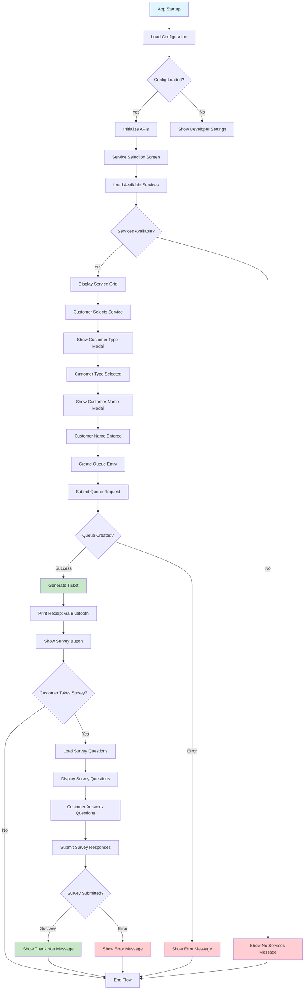
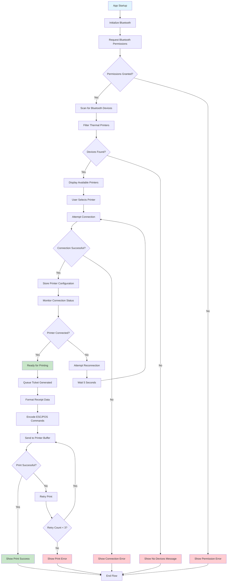

# AQMAS Mobile Queue Kiosk 

## Table of Contents

1. [Project Overview](#project-overview)
2. [Technology Stack](#technology-stack)
3. [Architecture](#architecture)
4. [Core Features](#core-features)
5. [File Structure](#file-structure)
6. [State Management](#state-management)
7. [API Integration](#api-integration)
8. [Bluetooth Integration](#bluetooth-integration)
9. [Development Setup](#development-setup)
10. [Build Configuration](#build-configuration)
11. [Security Considerations](#security-considerations)
12. [Performance Optimizations](#performance-optimizations)

## Project Overview

The AQMAS Mobile Queue Kiosk is a React Native application built with Expo that provides a comprehensive queue management system for service-oriented businesses. The application enables customers to join queues, select services, and participate in surveys while providing administrative tools for service management and receipt printing.

**Key Objectives:**

- Streamline customer queue management
- Provide real-time service selection
- Enable customer feedback through surveys
- Support receipt printing via Bluetooth
- Offer developer configuration tools

## Technology Stack

### Core Technologies

- **React Native 0.79.5** - Cross-platform mobile development framework
- **Expo SDK 53.0.20** - Development platform and build tools
- **TypeScript 5.8.3** - Type-safe JavaScript development
- **React 19.0.0** - UI library for building user interfaces

### State Management

- **Redux Toolkit 2.8.2** - State management with RTK Query
- **Redux Persist 6.0.0** - Persistent state storage
- **React Redux 9.2.0** - React bindings for Redux

### UI & Styling

- **NativeWind 4.1.23** - Tailwind CSS for React Native
- **TailwindCSS 3.4.17** - Utility-first CSS framework
- **React Native Reanimated 3.17.4** - Animation library
- **React Native Gesture Handler 2.24.0** - Touch handling

### Navigation & Routing

- **Expo Router 5.1.4** - File-based routing system
- **React Navigation 7.1.6** - Navigation library

### Hardware Integration

- **React Native Bluetooth Classic 1.73.0** - Bluetooth connectivity
- **@manhnd/esc-pos-encoder 1.0.25** - ESC/POS receipt printing

### Development Tools

- **ESLint 9.25.0** - Code linting
- **Babel 7.25.2** - JavaScript compiler
- **Metro** - React Native bundler

## Architecture

### Feature-Based Architecture

The application follows a feature-based architecture pattern where each major functionality is organized into its own feature directory:

```
features/
├── config/          # Configuration management
├── customer/        # Customer data management
├── device/          # Device information
├── developer/       # Developer settings and tools
├── queue/           # Queue management
├── service/         # Service selection and management
└── survey/          # Customer survey functionality
```

### Clean Architecture Principles

Each feature implements clean architecture with clear separation of concerns:

1. **API Layer** - Data fetching and external communication
2. **Components Layer** - UI presentation components
3. **Hooks Layer** - Business logic and state management
4. **Utils Layer** - Utility functions and helpers

### Component Structure

- **Layout Components** - Overall page structure and navigation
- **Feature Components** - Specific functionality components
- **Shared Components** - Reusable UI components
- **Modal Components** - Overlay dialogs and forms

## Core Features

### 1. Service Management

- **Service Grid Display** - Visual grid of available services
- **Service Selection** - Multi-service selection capability
- **Service Navigation** - Pagination and navigation controls
- **Service Configuration** - Dynamic service loading and display

### 2. Queue Management

- **Queue Creation** - Customer queue entry with service selection
- **Customer Type Selection** - Priority and customer type management
- **Customer Name Collection** - Optional customer identification
- **Queue Confirmation** - Ticket generation and confirmation

### 3. Survey System

- **Dynamic Survey Loading** - Server-driven survey questions
- **Multiple Question Types** - Yes/No, multiple choice, text input
- **Customer Information Collection** - Name, address, contact details
- **Survey Submission** - Data validation and server submission

### 4. Bluetooth Integration

- **Device Discovery** - Automatic Bluetooth device scanning
- **Connection Management** - Persistent device connections
- **Receipt Printing** - ESC/POS formatted receipt generation
- **Print Queue Management** - Queued printing with error handling

### 5. Developer Tools

- **API Configuration** - Server endpoint configuration
- **Bluetooth Settings** - Device connection management
- **Configuration Display** - Current settings overview
- **Development Tips** - Helpful development information

## File Structure

```
mobile-queue/
├── app/                    # Expo Router pages
│   ├── (developer)/       # Developer settings routes
│   ├── (service)/         # Service management routes
│   └── (survey)/          # Survey routes
├── assets/                 # Static assets
│   ├── fonts/             # Custom fonts
│   ├── icons/             # App icons
│   └── images/            # Images and graphics
├── components/             # Shared components
├── features/               # Feature-based modules
│   ├── config/            # Configuration management
│   ├── customer/          # Customer data
│   ├── device/            # Device information
│   ├── developer/         # Developer tools
│   ├── queue/             # Queue management
│   ├── service/           # Service management
│   └── survey/            # Survey system
├── libs/                   # Core libraries
│   └── redux/             # State management
├── app.config.ts          # Expo configuration
├── package.json           # Dependencies and scripts
└── tailwind.config.js     # Tailwind configuration
```

## State Management

### Redux Store Structure

The application uses Redux Toolkit with RTK Query for efficient state management:

```typescript
// Store Configuration
const rootReducer = combineReducers({
  // Slices
  config: configReducer,
  survey: surveyReducer,
  customerSurvey: customerSurveyReducer,
  bluetooth: bluetoothReducer,

  // RTK Query APIs
  [serviceApi.reducerPath]: serviceApi.reducer,
  [configApi.reducerPath]: configApi.reducer,
  [queueApi.reducerPath]: queueApi.reducer,
  [customerApi.reducerPath]: customerApi.reducer,
  [surveyApi.reducerPath]: surveyApi.reducer,
  [deviceApi.reducerPath]: deviceApi.reducer,
});
```

### State Persistence

- **Redux Persist** - Persistent storage for critical state
- **AsyncStorage** - Local storage for configuration and settings
- **Blacklisted States** - Survey and API states excluded from persistence

### State Slices

1. **Config Slice** - Application configuration settings
2. **Survey Slice** - Survey state and responses
3. **Customer Survey Slice** - Customer information state
4. **Bluetooth Slice** - Bluetooth connection and device state

## API Integration

### API Flow Overview

The application follows a comprehensive API flow for managing queue operations, service selection, and customer interactions:



### RTK Query Implementation

The application uses RTK Query for efficient API management:

```typescript
// API Endpoints
-serviceApi - // Service management endpoints
  configApi - // Configuration endpoints
  queueApi - // Queue management endpoints
  customerApi - // Customer data endpoints
  surveyApi - // Survey endpoints
  deviceApi; // Device information endpoints
```

### API Features

- **Automatic Caching** - Intelligent data caching
- **Background Updates** - Real-time data synchronization
- **Error Handling** - Comprehensive error management
- **Loading States** - User-friendly loading indicators
- **Optimistic Updates** - Immediate UI feedback

### API Configuration

- **Base URL Configuration** - Dynamic server endpoint setup
- **Authentication** - Token-based authentication
- **Request/Response Interceptors** - Global request handling
- **Error Retry Logic** - Automatic retry mechanisms

## Bluetooth Integration

### Bluetooth & Thermal Printer Flow

The application integrates with Bluetooth thermal printers for receipt generation and printing:



### Bluetooth Features

- **Device Discovery** - Automatic peripheral scanning
- **Connection Management** - Persistent device connections
- **Receipt Printing** - ESC/POS formatted printing
- **Error Handling** - Connection failure recovery

### ESC/POS Printing

```typescript
// Receipt Format
- Header with business information
- Service details and pricing
- Customer information
- Queue number and timestamp
- Footer with additional details
```

### Bluetooth Permissions

```json
{
  "android.permission.BLUETOOTH": "Bluetooth connectivity",
  "android.permission.BLUETOOTH_ADMIN": "Bluetooth administration",
  "android.permission.ACCESS_FINE_LOCATION": "Device discovery",
  "android.permission.BLUETOOTH_CONNECT": "Connection management",
  "android.permission.BLUETOOTH_SCAN": "Device scanning"
}
```

## Development Setup

### Prerequisites

- Node.js 18+
- npm or yarn package manager
- Expo CLI
- Android Studio (for Android development)
- Xcode (for iOS development, macOS only)

### Installation Steps

```bash
# Clone repository
git clone [repository-url]
cd mobile-queue

# Install dependencies
npm install

# Start development server
npm start

# Run on Android
npm run android

# Run on iOS
npm run ios
```

### Development Scripts

```json
{
  "start": "expo start -c -p 8082",
  "android": "expo run:android --port=8082",
  "ios": "expo run:ios",
  "web": "expo start --web",
  "lint": "expo lint"
}
```

## Build Configuration

### Expo Configuration

```typescript
export default {
  expo: {
    name: "Aqmas Kiosk",
    slug: "aqmas-queue-kiosk",
    version: "1.0.0",
    orientation: "default",
    userInterfaceStyle: "automatic",
    newArchEnabled: true,
    jsEngine: "hermes",
    // Platform-specific configurations
    ios: { supportsTablet: true },
    android: {
      adaptiveIcon: {
        /* icon configuration */
      },
      edgeToEdgeEnabled: true,
      package: "com.eaaaarl.aqmaskiosk",
      permissions: [
        /* Bluetooth permissions */
      ],
    },
  },
};
```

### Build Properties

- **New Architecture Enabled** - React Native new architecture
- **Hermes Engine** - JavaScript engine optimization
- **Edge-to-Edge** - Full-screen Android experience
- **Tablet Support** - iOS tablet compatibility

### Plugins Configuration

- **Expo Router** - File-based routing
- **Expo Splash Screen** - Custom splash screen
- **Expo Build Properties** - Build-time configurations
- **Bluetooth Classic** - Bluetooth functionality

## Security Considerations

### Data Protection

- **AsyncStorage Encryption** - Sensitive data encryption
- **API Token Management** - Secure token storage
- **Input Validation** - Client-side data validation
- **Error Handling** - Secure error message handling

### Network Security

- **HTTPS Communication** - Encrypted API communication
- **Certificate Pinning** - SSL certificate validation
- **Request Validation** - Server-side request validation
- **Rate Limiting** - API request rate limiting

### Bluetooth Security

- **Device Authentication** - Bluetooth device verification
- **Connection Encryption** - Encrypted Bluetooth communication
- **Permission Management** - Granular permission control

## Performance Optimizations

### React Native Optimizations

- **Hermes Engine** - Improved JavaScript performance
- **New Architecture** - Enhanced rendering performance
- **Memory Management** - Efficient memory usage
- **Bundle Optimization** - Reduced bundle size

### State Management Optimizations

- **Selective Persistence** - Only persist critical state
- **RTK Query Caching** - Intelligent data caching
- **Optimistic Updates** - Immediate UI feedback
- **Background Sync** - Efficient data synchronization

### UI Performance

- **Virtual Scrolling** - Efficient list rendering
- **Image Optimization** - Compressed image assets
- **Component Memoization** - Prevent unnecessary re-renders
- **Lazy Loading** - On-demand component loading

### Network Optimizations

- **Request Batching** - Batch API requests
- **Response Caching** - Cache API responses
- **Connection Pooling** - Efficient network connections
- **Compression** - Compressed data transfer

## Conclusion

The AQMAS Mobile Queue Kiosk represents a modern, scalable solution for queue management systems. Built with React Native and Expo, it provides a robust foundation for service-oriented businesses to streamline their customer management processes.

The application's feature-based architecture, comprehensive state management, and hardware integration capabilities make it suitable for deployment in various business environments. The developer-friendly configuration system and extensive documentation ensure maintainability and ease of future enhancements.

**Key Strengths:**

- Modular, maintainable codebase
- Comprehensive feature set
- Hardware integration capabilities
- Developer-friendly configuration
- Scalable architecture
- Performance optimizations
- Security considerations

This technical documentation serves as a comprehensive reference for understanding the application's architecture, implementation details, and deployment considerations.
